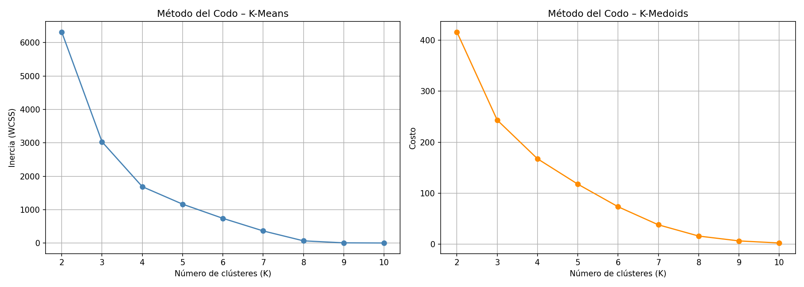
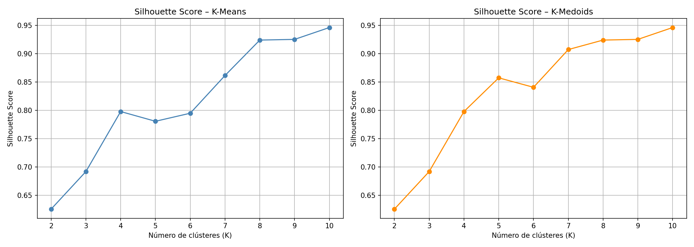
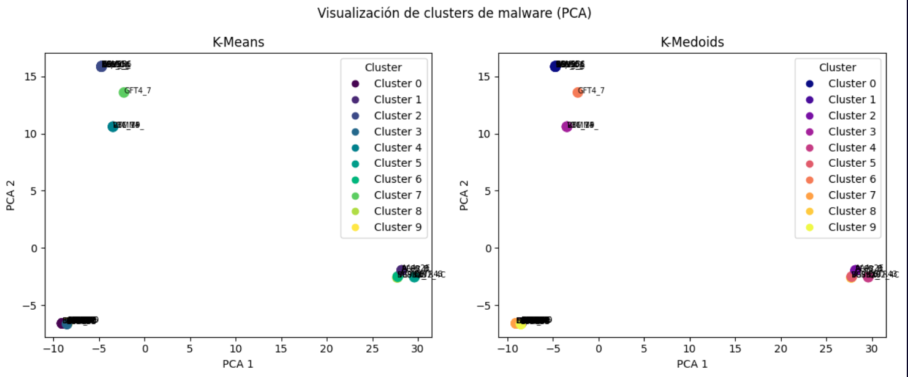
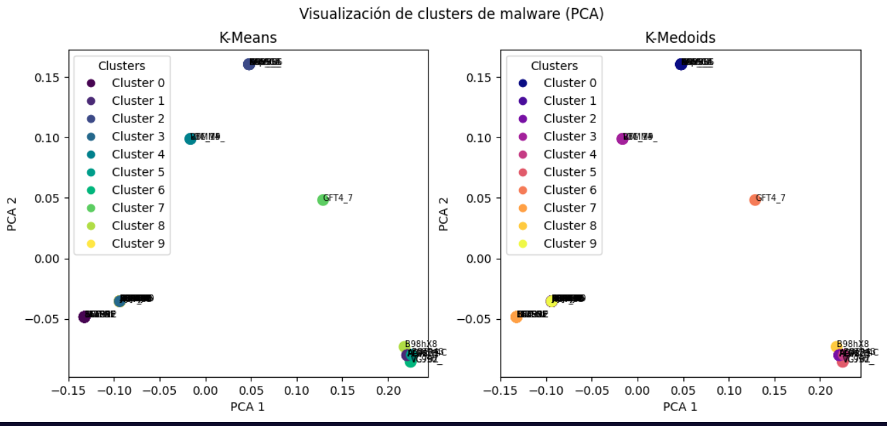
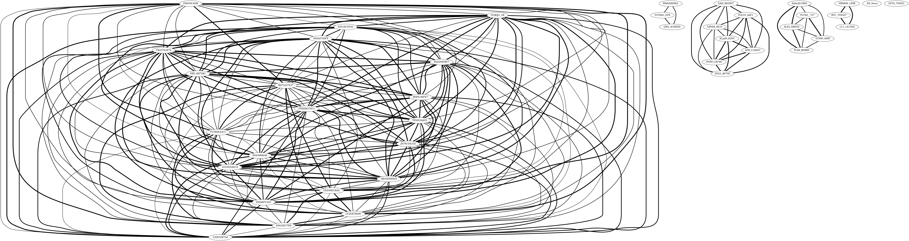
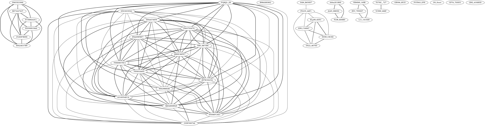
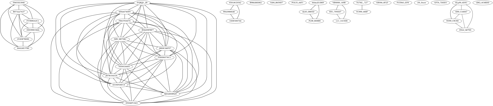

# Laboratrio 3: detección defamilias de Malware

En este laboratorio se identificaron distintas familias de malware utilizando los archivos infectados que fueron obtenidos en clase. 

## Datasets

Para identificar las familias se extrajeron los imports y el timestamp de complicación de cada archivo para formar un dataset y ya con ese dataset se implementaron varios algoritmos como clustering o el coeficiente de Jaccard. 

Puede ver el proceso aquí: [Notebook](./lab3.ipynb)

El dataset inicial fue formado usando Pefile para extraer los imports en el header de cada archivo y el timestamp de complicación, este dataset incial se encuentra disponible en: [Dataset](./raw_data.csv)

Luego, para implementar el clustering, se realizó TF-IDF sobre los imports y esto dio como resultado que cada conjunto de imports de cada archivo se convirtiera en un vector de 360 componentes. Este dataset se encuentra disponible en: [Dataset TF-IDF](./transformed.csv)

Después se implementaron los algoritmos de clustering y se guardó un archivo que contiene la etiqueta que indica a que clúster pertenece cada archivo: [Clustering](./labeled.csv)

Finalmente se realizón un dataset con los embeddings de cada archivo usando Gemini: [Embeddings](./embeddings.csv)

## Implementación de algoritmos

Una vez con los datasets, se implementaron 2 algoritmos de particionamiento, K-means y K-Metroids, los datos de los datasets fueron normalizados para implementar los algoritmos. Se utilizó el método del codo y el coeficiente de Silhouette, estos fueron los resultados obtenidos

Se puede observar que según el método del codo lo óptimo serían 7 clústers pues a partir de ese valor se obtiene una caída más suavizada en ambos algoritmos, sin embargo la caída es un poco difícil de distinguir. Por esa razón se usó el coeficiente del Silhoutte para tenerotra referencia del número óptimo de clústers y con este algoritmo se obtuvo que 10 clústers es el valorideal de clústers, no difiere tanto del método del codo pues esteb algoritmo también indica que con 7 clústers obtendríamos buenos resultados. 
En base a eso, se usaron 10 clústers para entrenar a los algoritmos y por lo tanto se infiere que hay 10 familias de malware en los ejemplares.
Finalmente, se utilizó PCA para reducir los vectores TF-IDF a 2 dimensiones y esta esla visualización de las familias:

Luego, se utilizaron los embeddings de Gemini para comparar los resultados, se generaron embeddings de cada secuencia de imports de cada archivo y luego se redujeron a 2 dimensiones usando PCA. Este fue el resultado: 

Los resultados no son exactamente iguales aunque las familias de malware se agrupan de una forma similar pues hay familias como la  4 y 0 se agrupan en el borde inferior izquierdo del plano, 

Finalmente, se usó el índice de Jaccard con los strings e imports de cada archivo malicioso. Con un  0.60 de similitud estos fueron los resultados

Con 0.6 el grafo es muy denso y muchos archivos están relacionados, sin embargo cuando aumentamos el umbral de coincidencia se observa que el grafo se vuelve menos denso y que los archivos empiezan a agruparse en familias y que con un 0.95 de coincidencia se observan 14 familias de malware, este número es bastante cercano a 10, el número de familias identificadas con los algortimos de partición, por lo que los resultados fueron bastante similares. También se observa que hay archivos como el JKK8CA6FE7 y FHHH6576C1 que fueron agrupados en la misma familia tanto con Jaccard y con los algoritmos de partición. 

